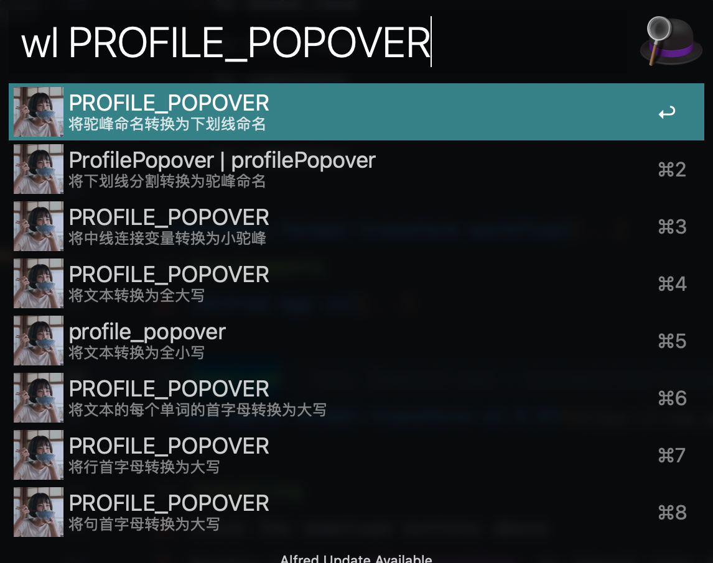

variable-format-transform workflow
=====================

## About
### The following formats are supported
- camelCase
   - to SNAKE_CASE
   - to snake_case
   - to kebab-case
   - to PascalCase
- SNAKE_CASE
   - to snake_case
   - to kebab-case
   - to camelCase
- kebab-case
   - to camelCase

## Requirements
1. [Alfred App v4](http://www.alfredapp.com/#download)

## Download
- [variable-format-transform-v2.0.0](https://raw.githubusercontent.com/lilywang711/alfred-workflow-transform/master/variable-format-transform.alfredworkflow)

## Installing
1. Click the download buttons above
2. Double-click `.alfredworkflow` to import into Alfred
3. Replace hotkey if you want

## Commands
- `wl {query}`
- `wl myFirstName`
- `wl my-first-name`
- `wl MY_FIRST_NAME`
